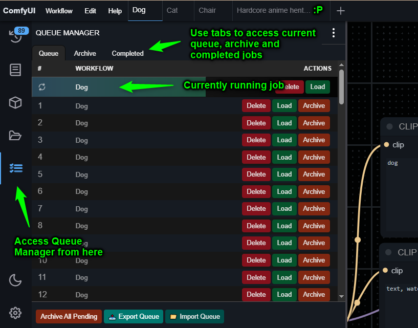
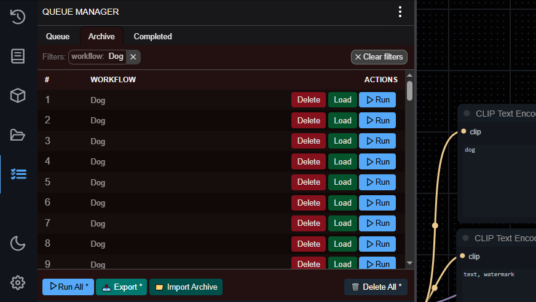

# ComfyUI Queue Manager

An extension supporting more streamlined prompt queue management.

## Quickstart

1. Install [ComfyUI](https://docs.comfy.org/get_started).
1. Install [ComfyUI-Manager](https://github.com/ltdrdata/ComfyUI-Manager) if it is not already installed (recent versions come with it already).
1. Look up this extension in ComfyUI-Manager (ComfyUI Queue Manager). If you are installing manually, clone this repository under `ComfyUI/custom_nodes`.
1. Restart ComfyUI.

## Important

- EARLY ACCESS RELEASE, PROOF OF CONCEPT, PROTOTYPE. This is an early access release of the ComfyUI Queue Manager. While fully functional, things will change, a lot.
- Releasing just because I want to get feedback and free labour for testing. Been using it for a while now, and it helped me immensely to manage my renders.
- Many features still not implemented, but the core functionality is there and roadmap is set.

## Features
- Persistence. Queue is now saved in a local database and restored on ComfyUI restart.
- Option to archive queue items to play them later.
- Export and import queue to / from a file.
- Pause and resume queue.
- Filter by workflows and then archive, delete and export filtered view only.

## Compatibility
- This extension requires the new ComfyUI menu.
- When this extension is enabled then the native queue will no longer display pending queue items. However, history will still be there.
- This extension hijacks several native queue processes from ComfyUI and front end and alters / disables some of them to provide a more streamlined experience.
- This extension might be incompatible with other extensions that directly manipulate or read the native queue object.
- Other than that an effort was made to retain compatibility as much as possible (internal events, messages, queue api endpoints still work as before).

## Roadmap
In no particular order, just some ideas I have for the future of this extension.
- [ ] Options. Toggles, big red buttons, levers and valves to control Queue Manager's behavior. Now everything is hardcoded.
- [ ] Queue Manager node. Workflow name string and some other strings you could use to streamline file names etc. for your workflows.
- [ ] Bin. Can't think of a use case for it yet but I feel like it should be there at some stage.
- [ ] Cover images, thumbnails, previews of rendered images in the queue. In other words what we have in core queue History with some spices added.
- [ ] More columns in the queue table. Suggest your favourites.
- [ ] Better user and dev docs.
- [ ] Better progress feedback for longer running actions (like import).

and other things I forgot about.

## Manual
### Pause / Resume Queue
Click the pause button to pause the queue.
Currently running workflow will finish, but no new workflows will be started until you resume the queue.

Click the play button to resume the queue.

### Running and main Queue Manager window
You can start running jobs as usual using the Run button in the main ComfyUI window.

To view the Queue Manager window, click the Queue Manager button in the sidebar menu.

On the right you have action buttons like Delete, Load, Archive, Run which are applicable to a single item in the queue.

On the bottom you have buttons like Archive All, Export Queue etc. which are applicable to all items in the current tab.

When button on the bottom has a asterisk `*` next to it, it means that the action will be applied to the items in filtered view only (see **Filter by workflow** below).

### Archive
**Archive** is a place where you can park your queue items to play them later.

When in the **Queue** tab you can archive individual items by clicking the **Archive** button in the actions columns or you can archive all items in the queue by clicking the **Archive All** button on the bottom of the window.

Similarly, when in **Archive** tab you can play archived items by clicking the **Run** button in the actions column or you can play all archived items by clicking the **Run All** button on the bottom of the window.

### Export and Import

You can export items from any tab (Queue, Archive, Completed) to a file by clicking the Export Queue/Archive/Completed button on the bottom of the window.
You can import items from a file to the Queue or to the Archive by clicking the Import Queue/Archive button on the bottom of the window.

### Filter by workflow
You can filter the currently displayed list of items by workflow by clicking on the name in the workflow column.

Once filtered out the group actions on the bottom of the window (like `Archive All *`, `Run All *`, `Delete All *`) will only apply to the filtered items.

Asterisk `*` next to the button label indicates that the action will be applied to the filtered items only.

### Restore client focus
When you restart ComfyUI or browser, you might lose the client focus. When that happens the progress of running renders in ComfyUI will no longer update (no progress view, no previews, no highlights which nodes is being executed).

To restore the client focus, click the three vertical dots menu and select `Take over focus`.

### Workflow Name node
You can use the Workflow Name node to get the name of the currently running workflow.
Typical use case is to connect the `workflow_name` output to a node that accepts a string input, like **Save Image**'s `filename_prefix`, to have output images saved with the workflow's name as a prefix.

## Development
Don't lol. Things will change and move around a lot.
Nevertheless, here are some pointers if you have some PR ideas for critical fixes or features:
- `/web` is the front end part of the extension.
  - Inside is `.gui` folder which is hidden from default ComfyUI UI, but it's where the build version of the Queue Manager is.
- The core front end functionality of the Queue Manager is a Next.js app loaded in an iframe (from  `.gui` folder). It communicates with loading part of the extension by postMessage API.
- Server side (python) part of the extension is in `/src/comfyui_queue_manager`
- Source code for the Next.js app is in `/src/gui`
- database is in `/data/` (sqlite files are created automatically on first run)
Better docs will come later.

## Have fun!
Queue all the way to the moon.
